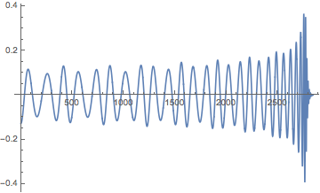

# EccentricIMR

## About

A Mathematica package for generating gravitational waveforms for
nonspinning eccentric binary black hole mergers.

Requirements: Mathematica v10 (Jul 2014) or later

EccentricIMR was written by Ian Hinder and is distributed under the terms of the GNU General Public Licence (GPL) version 2.

Copyright (C) Ian Hinder, 2017.

See _Hinder, Kidder and Pfeiffer - An eccentric binary black hole inspiral-merger-ringdown gravitational waveform model from numerical relativity and post-Newtonian theory_, 2017 for details of the construction of the waveform.

## Installation

### Using Git (recommended)

Change into your Mathematica applications directory.

For Mac OS,

    cd ~/Library/Mathematica/Applications

For Linux,

    cd ~/.Mathematica/Applications

Clone the repository

    git clone https://github.com/ianhinder/EccentricIMR.git

### Zip file download

- Download
[master.zip](https://github.com/ianhinder/EccentricIMR/archive/master.zip),
- Extract the zip file
- Rename the extracted directory EccentricIMR-master as
EccentricIMR
- Move the directory into your Mathematica applications directory
(~/Library/Mathematica/Applications on Mac OS,
~/.Mathematica/Applications on Linux)

## Quick start

Open a new Mathematica notebook and enter the following:

    << EccentricIMR`;

    params = <|"q" -> 1, "x0" -> 0.07, "e0" -> 0.1,
               "l0" -> 0, "phi0" -> 0, "t0" -> 0|>;

    hEcc = EccentricIMRWaveform[params, {0, 10000}];

    ListLinePlot[Re[hEcc]]

## Documentation

### EccentricIMRWaveform[_parameters_, {_t1_, _t2_}]

Generate an eccentric inspiral-merger-ringdown waveform with the parameters given in the time range {t1,t2}.  

_parameters_ is an Association with the following entries:

Parameter | Meaning
--------- | ---
q         | Mass ratio of the binary (q=m1/m2)
t0        | _Reference time_ at which the remaining parameters are quoted
x0        | Dimensionless frequency parameter (x = (M om_orb)^(2/3)) evaluated at the reference time
e0		   | Eccentricity at the reference time
l0		   | Mean anomaly at the reference time
phi0	   | Orbital phase at the reference time

See [arXiv:0806.1037](http://arxiv.org/abs/arXiv:0806.1037) for full details about the meaning of the parameters.

The returned waveform is expressed as a list of {t, h22} pairs, where t is the retarted time coordinate and h22 is the l=2, m=2 spin-weighted spherical harmonic coefficient of the waveform.

Example:

    In[1]:= hEcc = EccentricIMRWaveform[<|"q" -> 1, "x0" -> 0.07,
      "e0" -> 0.1, "l0" -> 0, "phi0" -> 0, "t0" -> 0|>,
      {0, 10000}];

    In[2]:= Take[hEcc, 10]

    Out[2]:= {{0., -0.127741 + 0.000381028 I}, {1., -0.127596 + 
    0.00619006 I}, {2., -0.127182 + 0.0119862 I}, {3., -0.126498 + 
    0.0177567 I}, {4., -0.125546 + 0.0234884 I}, {5., -0.12433 + 
    0.0291683 I}, {6., -0.122851 + 0.0347835 I}, {7., -0.121113 + 
    0.0403215 I}, {8., -0.119122 + 0.0457697 I}, {9., -0.11688 + 
    0.051116 I}}

## Tests

Open the notebook EccentricIMRTests.nb from the package directory and evaluate it.  The will run tests of several internal functions, as well as EccentricIMRWaveform.
